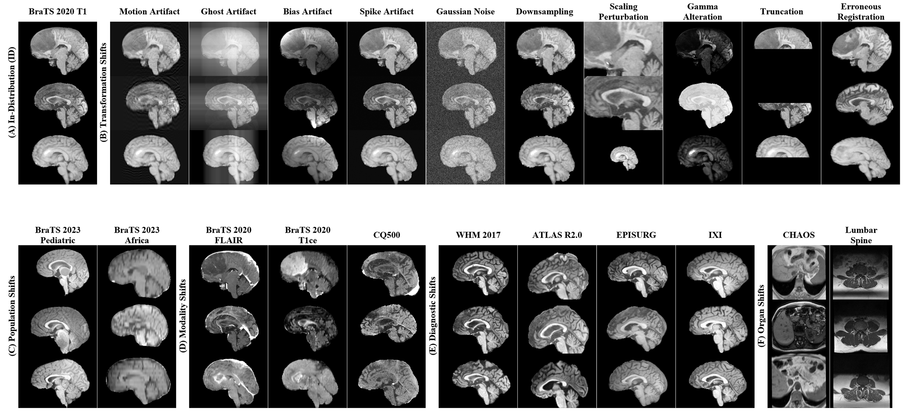

# MedOODFlow: Out-of-Distribution Detection in Medical Imaging with Normalizing Flows

This repository contains the code for the paper *"Safeguarding AI in Medical Imaging: Post-Hoc Out-of-Distribution Detection with Normalizing Flows"*
by [Dariush Lotfi](https://scholar.google.com/citations?user=92-ViGUAAAAJ&hl=en), [Mohammad-Ali Nikouei Mahani](https://scholar.google.com/citations?user=9D3HgLsAAAAJ&hl=en), [Mohamad Koohi-Moghadam](https://scholar.google.com/citations?user=obSQRjAAAAAJ&hl=en), and [Kyongtae Ty Bae](https://scholar.google.com/citations?user=M7Fi-dQAAAAJ&hl=en).


## Abstract
In AI-driven medical imaging, the failure to detect out-of-distribution (OOD) data poses a severe risk to clinical reliability, potentially leading to critical diagnostic errors. Current OOD detection methods often demand impractical retraining or modifications to pre-trained models, hindering their adoption in regulated clinical environments. To address this challenge, we propose a post-hoc normalizing flow-based approach that seamlessly integrates with existing pre-trained models without altering their weights. Our evaluation used a novel in-house–built dataset, MedOOD, meticulously curated to simulate clinically relevant distributional shifts, alongside the MedMNIST benchmark dataset. On our in-house MedOOD dataset, our method achieved an AUROC of 84.61%, outperforming state-of-the-art methods like ViM (80.65%) and MDS (80.87%). Similarly, on MedMNIST, it reached an exceptional AUROC of 93.8%, surpassing leading approaches such as ViM (88.08%) and ReAct (87.05%). This superior performance, coupled with its post-hoc integration capability, positions our method as a vital safeguard for enhancing safety in medical imaging workflows.


## Based on OpenOOD
This project is built upon [OpenOOD](https://github.com/Jingkang50/OpenOOD). For more details, you can refer to the original README file [here](OpenOOD_README.md).


## Installation
Create a Python 3.10+ environment and install the required packages:
```sh
pip install -r requirements.txt
pip install libmr
```

## Getting Started

### Download MedMNIST Datasets
To download the required 28x28 image-sized datasets from the MedMNIST benchmark, first install the `medmnist` package:
```sh
pip install medmnist
```
Then, run the following script:
```sh
sh ./scripts/download/download_medmnist.sh
```

### Download and Prepare MedOOD Datasets
We created a curated collection of medical datasets, **MedOOD**, specifically designed to benchmark OOD detection in
medical imaging. It includes datasets from diverse imaging modalities and clinically relevant distributional shifts,
providing a robust foundation for evaluating OOD detection models.
For instructions on preparing the MedOOD datasets, please refer to the [medood/README.md](medood/README.md) file.



### Training and evaluation scripts
We provide the training, evaluation, and visualization scripts for our proposed OOD detection method in [scripts/ood/nflow](scripts/ood/nflow) folder.

### Pre-trained ResNet18 classifier on OrganAMNIST
For the ResNet18 classifier on OrganAMNIST, we utilized the official pre-trained model provided by the MedMNIST curators.
You can download the pre-trained model from [here](https://doi.org/10.5281/zenodo.7782113).
In our experiments, we specifically used the `resnet18_28_1.pth` file included in the `weights_organamnist.zip` archive.

### Train a 3D-ResNet18 classifier on BraTS2020-T1:
To train a 3D-ResNet18 classifier on BraTS2020-T1, you can run the following script:
```sh
sh ./scripts/basics/brats20_t1/train_brats20_t1.sh
```

## Citation

If you find this work useful for your research, please cite our paper.

```bibtex
@article{lotfi2025medoodflow,
  title={Safeguarding AI in Medical Imaging: Post-Hoc Out-of-Distribution Detection with Normalizing Flows},
  author={Dariush Lotfi and Mohammad-Ali Nikouei Mahani and Mohamad Koohi-Moghadam and Kyongtae Ty Bae},
  journal={arXiv preprint arXiv:2502.11638},
  year={2025}
}
```
